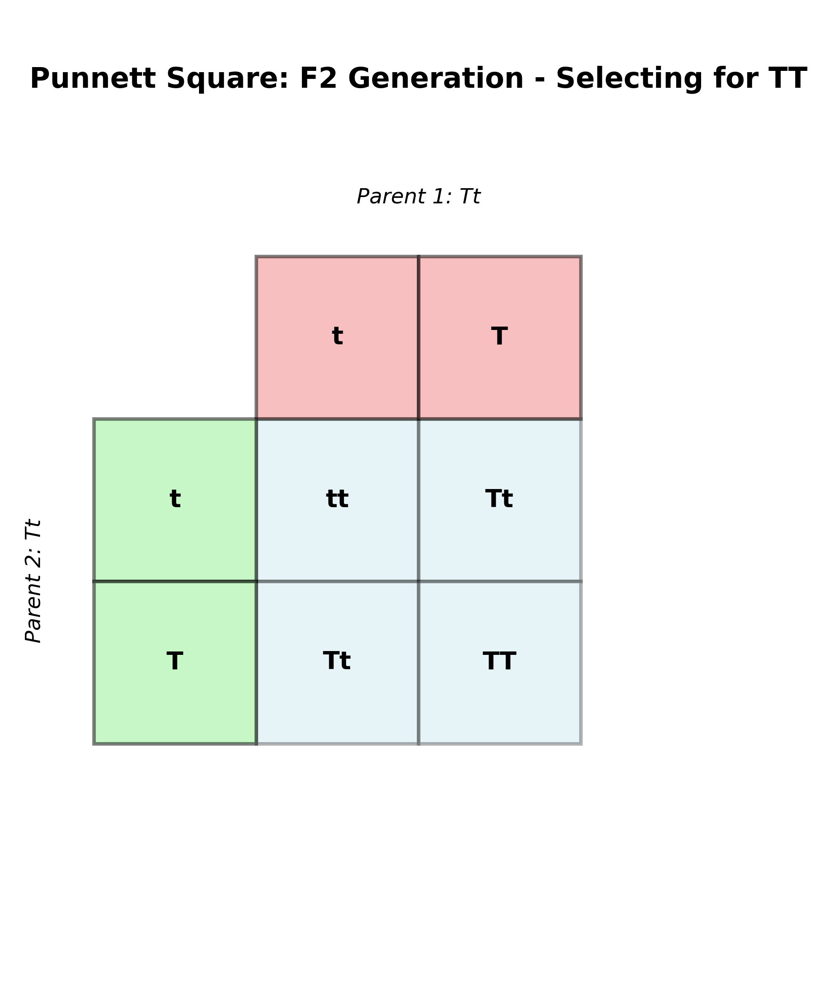
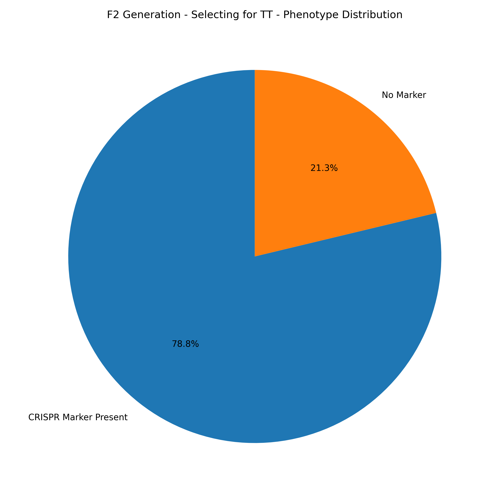
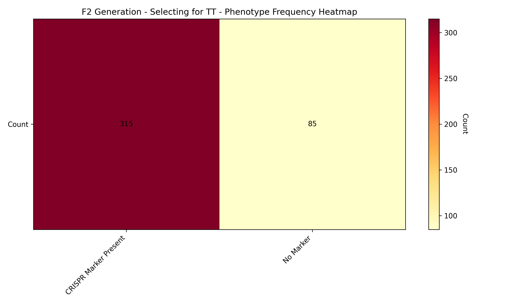

# Fruit Fly Genetics Tracker

A Python tool for tracking and analyzing fruit fly genetic crosses, designed for genetics research labs.

## Features

- Automatic Punnett square generation
- Expected ratio calculations for single and multi-trait crosses
- Chi-square statistical testing
- Data visualization (bar charts, pie charts)
- Experiment tracking and history
- Persistent storage with JSON
  
## Sample Results

Below are example visualizations generated by the Fruit Fly Genetics Tracker:





## Installation

1. Install Python 3.8 or higher
2. Install dependencies:
   ```bash
   pip install matplotlib scipy
   ```

3. Run the program:
   ```bash
   python main.py
   ```

## Usage

### Creating an Experiment
1. Select "Create new experiment" from main menu
2. Enter experiment name
3. Enter parent genotypes (e.g., "Ee" or "Ee Ww")
4. Define what each allele represents
5. Enter expected offspring count

### Adding Observations
1. Select "Add observation data"
2. Choose your experiment
3. Enter observed counts for each phenotype
4. Statistical analysis runs automatically

### Viewing Results
1. Select "View experiment results"
2. Choose your experiment
3. See expected vs observed data and chi-square test results

### Generating Charts
1. Complete an experiment with observations
2. Select "Generate visualizations"
3. Choose chart type
4. Charts saved to exports/ folder

## Project Structure

```
fruit_fly_tracker/
├── main.py                 # Entry point
├── config.py               # Configuration
├── models/                 # Data structures
│   ├── genotype.py
│   ├── experiment.py
│   └── allele.py
├── core/                   # Business logic
│   ├── genetics.py
│   └── statistics.py
├── storage/                # Data persistence
│   └── file_storage.py
├── visualization/          # Charts
│   └── charts.py
├── cli/                    # User interface
│   ├── menu.py
│   └── display.py
├── data/                   # Stored experiments
└── exports/                # Generated reports
```

## Author

Jiya Gangwar
